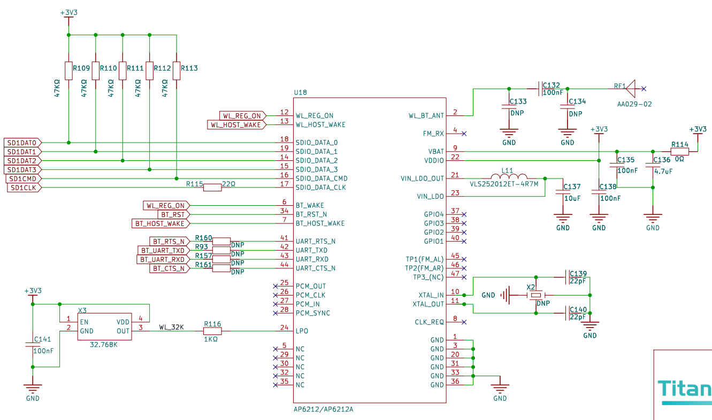
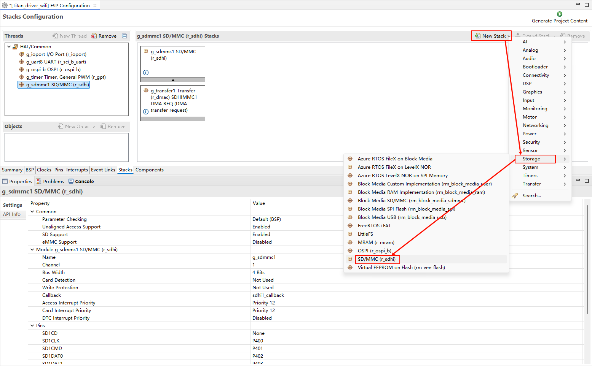
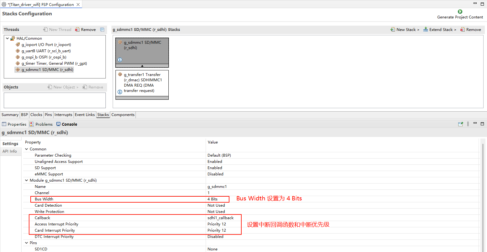
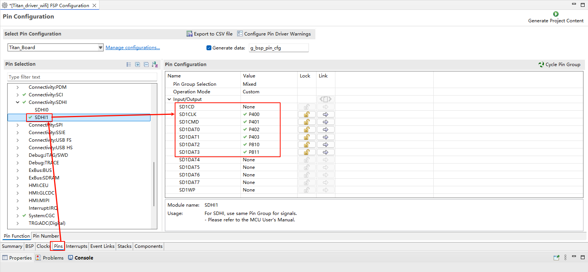
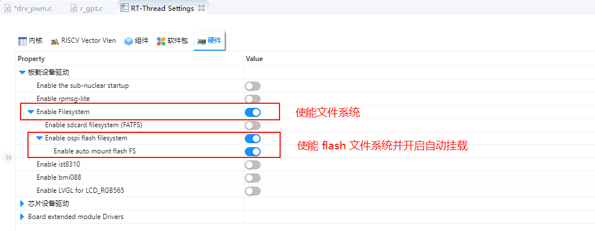
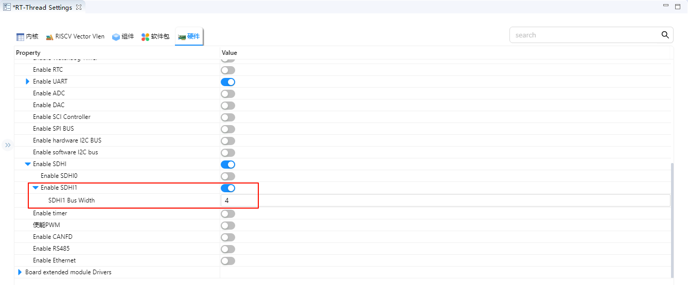
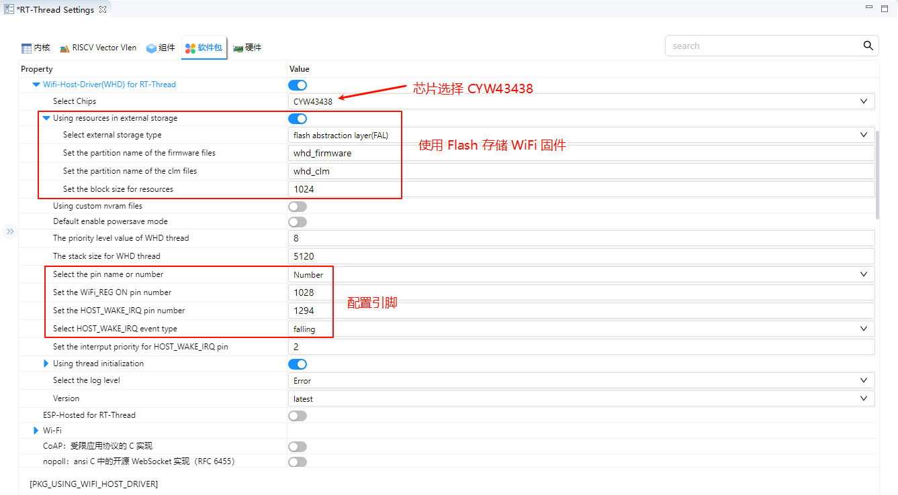

# Titan Board SDIO Wi-Fi (CYWL6208-GS / CYW43438)

[English] | [中文](README_zh.md)

RT-Thread example project for **Titan Board (Renesas RA8 series)**. It uses **SDHI (r_sdhi)** as an **SDIO host** to drive the **CYWL6208-GS Wi-Fi module** (chip **CYW43438**) and provides TCP/IP networking via **WHD + lwIP**.

## Hardware

- Titan Board (RA8 series)
- CYWL6208-GS (CYW43438), SDIO 4-bit mode

## Toolchain

- RT-Thread Studio (recommended)
- Serial terminal with **YMODEM** (e.g. Xshell)

## Build & Download

1. Open this project in RT-Thread Studio.
2. Install required RT-Thread packages (e.g. WHD) via the package manager.
3. Build and download via the board's USB-DBG port.

## Wi-Fi Firmware (first boot)

If the terminal prints firmware read errors, download the Wi-Fi firmware into Flash via YMODEM:

1. Run whd_res_download whd_firmware, then send irmware/43438A1.bin
2. Run whd_res_download whd_clm, then send irmware/43438A1.clm_blob

## Connect & Test

- Join AP: wifi join <ssid> <password>
- Ping test: ping baidu.com

## Notes

- Flash/partition configuration references the Titan_component_flash_fs project (not included here).
- This repo does not vendor 
t-thread/ by default. When cloning from GitHub, use RT-Thread Studio to fetch the RT-Thread sources/packages required by this project.

## Directory

- src/: application code
- 
a/, 
a_cfg/, 
a_gen/: Renesas FSP generated code/config
- irmware/: CYW43438 firmware & CLM blob
- igures/: screenshots

FSP / RT-Thread configuration screenshots (reference)

### Hardware

### FSP

- Configure Flash first (see the README in the Titan_component_flash_fs project).
- Configure SDHI1 and add a new 
_sdhi stack:

- Configure the 
_sdhi stack:

- Configure SDHI1 pins:

### RT-Thread Settings

- Enable OSPI Flash:

- Set SDHI1 bus width to 4:

- Configure the WHD package:

