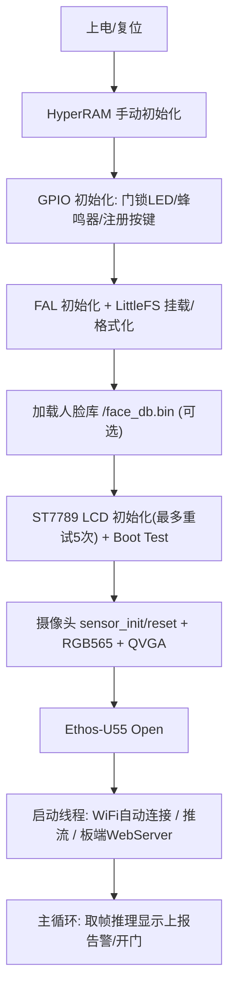
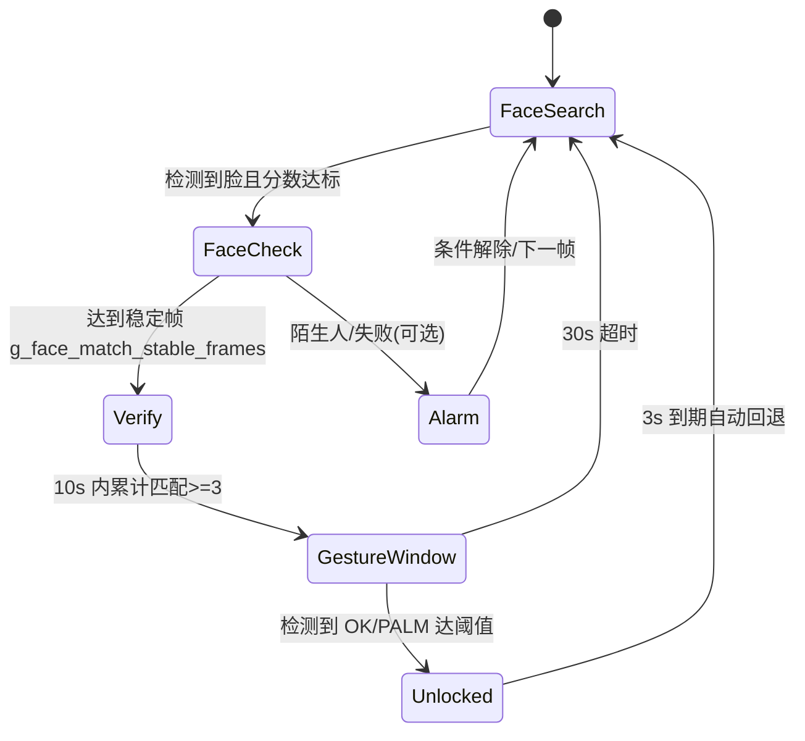
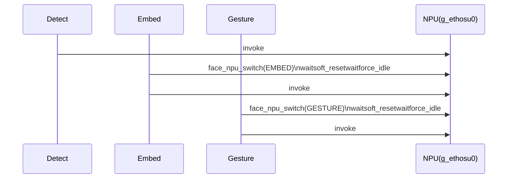

# 基于 RA8P1 + Ethos-U55 的多模型协同智能门禁系统项目介绍书

> 项目名称：基于 RA8P1 + Ethos-U55 的多模型协同智能门禁系统  
> 项目类型：嵌入式 AI 边缘智能门禁  
> 核心关键词：人脸检测、人脸识别、手势确认、NPU 部署、WiFi 图传、Web 运维控制、嵌入式工程化

---

## 一、项目摘要

我针对"低功耗、低成本、高可靠"的边缘门禁场景，设计并实现了一套完整的多模型协同智能门禁系统：

- 以 **人脸检测 + 人脸识别 + 手势确认** 三阶段链路，实现"可识别、可确认、可追踪"的访问控制；
- 以 **板端推流 + 网页端控制 + 运行态回传** 构建可视化运维闭环；
- 以 **NPU 优先推理 + 资源分时调度 + 文件系统模型热加载** 实现可落地的工程部署。

本系统不是单点功能演示，而是从算法到硬件、从固件到前端、从交互到稳定性的一体化系统实现，具备面向真实门禁场景的可部署价值。

---

## 二、项目背景与问题定义

传统门禁的常见问题：

1. **单因子认证风险高**：仅刷卡或仅密码易被借用、泄露。
2. **设备状态不可观测**：运维人员无法实时获知识别状态、告警状态、门锁状态。
3. **弱网与边缘设备协同差**：常见"控制指令发出但设备未执行"的不可见失败。
4. **嵌入式多模型并发不稳定**：模型切换、内存与总线竞争容易导致超时或卡死。

我的目标是在资源受限 MCU 平台上，做到：

- 识别链路可信（多阶段判定）；
- 实时反馈可见（屏幕 + 网页 + 事件）；
- 整机长期稳定（避免 NPU/内存异常）；
- 部署维护可操作（模型文件、远程控制、日志追溯）。

---

## 三、总体方案与系统架构

### 3.1 硬件层

- 主控平台：RA8P1（RT-Thread）
- AI 加速：Ethos-U55 NPU
- 感知：摄像头（QVGA）
- 显示：ST7789 LCD
- 网络：WiFi（WHD/LwIP）
- 执行器：
  - 门锁指示绿灯（P613）
  - 蜂鸣器（PA07）
- 存储：OSPI Flash + 文件系统（模型文件与人脸库）

### 3.2 软件层

- 固件核心：`src/hal_entry.c`
- 图传/控制服务：`script/pc_stream_server.py`
- 模型资产：
  - 人脸 embedding：`/emb/mobilefacenet_u55.bin`
  - 手势模型：`/gesture/gesture_u55.bin`

### 3.3 业务链路（门禁闭环）

1. 检测到人脸（进入候选）
2. 人脸 embedding 与库比对（稳定通过）
3. 进入手势确认窗口（限定时长）
4. 检测到指定手势后开门（门状态可视化）
5. 超时/失败触发回退与告警

---

### 3.4 启动流程详解

本节以固件入口 `src/hal_entry.c` 为主线，说明系统上电后如何一步步启动至门禁业务可用状态，并标注各阶段的关键反馈（LCD / LED / 蜂鸣器 / 网页）。

#### 3.4.1 启动时序总览（上电  业务主循环）

（代码锚点：`src/hal_entry.c:2131` 起的 `hal_entry()`，其顶部注释给出 1~9 的初始化顺序。）



关键实现对应：

- HyperRAM 初始化：`manual_hyper_ram_init()`（`src/hal_entry.c:2138`）
- 文件系统：`fal_init()` + `dfs_mount()` / `dfs_mkfs()`（`src/hal_entry.c:2155`）
- 人脸库加载（存在则读入）：`face_db_load_fs()`（`src/hal_entry.c:2187`，文件为 `/face_db.bin`）
- LCD 初始化重试 + Boot Test：`st7789_init()` + `st7789_show_boot_test()`（`src/hal_entry.c:2202`、`src/hal_entry.c:2219`）
- 摄像头初始化（RGB565 + QVGA 320240）：`sensor_init()` / `sensor_set_pixformat()` / `sensor_set_framesize()`（`src/hal_entry.c:2237`）
- NPU 启动：`RM_ETHOSU_Open()`（`src/hal_entry.c:2261`）
- 线程启动：
  - WiFi 自动连接线程 `wifi_auto_connect_entry()`（`src/hal_entry.c:2268`，内部 `rt_wlan_connect()` 在 `src/hal_entry.c:1993`）
  - 推流线程 `stream_client_entry()`（`src/hal_entry.c:2276`）
  - 板端 WebServer `web_server_entry()`（`src/hal_entry.c:2297`，监听 `HTTP_PORT=80`，路由说明见 `src/hal_entry.c:1910`）

#### 3.4.2 两套网页/运维通道的分工

本系统实际提供两套独立的网页/网络通道：

1) **板端 WebServer（设备自身，端口 80）**  
用于局域网内直接访问板子 IP，支持预览、抓图、读取运行态、修改控制参数。  
（`src/hal_entry.c:1910`：`GET /`、`GET /capture.bmp`、`GET /api/runtime`、`GET /api/control`）

2) **PC 端运维台（Flask，端口 8080）+ 视频流接收端口（9000）**  
用于板子主动推送视频帧到 PC，以及板子主动拉取控制、上报状态，实现更稳定的运维闭环。  
（端口宏：`src/hal_entry.c:1455`，PC 端实现：`script/pc_stream_server.py:107`、`script/pc_stream_server.py:288`、`script/pc_stream_server.py:298`）

演示时优先使用 PC 运维台（功能更完整：视频 + 控制 + 事件）；板端 WebServer 作为离线/应急/本地调试的备用通道。

---

### 3.5 解锁流程详解

本系统的"解锁"不是单次识别即开门，而是采用 **三段式纵深链路**：

1) 人脸检测（进入候选）
2) embedding 比对（稳定通过 + 多次确认）
3) 手势确认（主动意图表达） 开门

#### 3.5.1 解锁状态机（业务视角）



#### 3.5.2 关键阈值/时间窗

（阈值定义：`src/hal_entry.c:71`、`src/hal_entry.c:87`）

- 人脸比对阈值：`FACE_MATCH_THR2_MILLI=880`（余弦 1000）
- 稳定帧判定：`FACE_MATCH_STABLE_FRAMES=5`
- 稳定保持宽限：`FACE_MATCH_GRACE_MS=1200ms`
- 多次匹配窗口：`FACE_MULTI_MATCH_WINDOW_MS=10000ms` 且 `FACE_MULTI_MATCH_NEED=3`
- 手势确认窗口：`GESTURE_WINDOW_MS=30000ms`
- 开门保持：`DOOR_UNLOCK_HOLD_MS=3000ms`
- 手势阈值：`GESTURE_OK_THR_MILLI=500`，稳定帧 `GESTURE_OK_STABLE_FRAMES=1`

#### 3.5.3 "从识别到开门"的代码路径

1) **进入手势窗口的条件（多次确认 + 窗口计数）**  
`src/hal_entry.c:2590`：在 `stable_match_id` 已稳定的前提下，统计 10 秒内命中次数，达到 3 次才开启 `g_gesture_window_active`。

2) **手势推理与开门动作**  
`src/hal_entry.c:2823`：

- 进入手势推理：`face_npu_switch(FACE_NPU_OWNER_GESTURE)`  `gesture_detect_run()`  
- 命中阈值：`best_palm_m >= GESTURE_OK_THR_MILLI`  `g_gesture_ok_cnt++`  
- 开门：`g_door_unlocked=1`，并设置 `g_door_unlock_until` 3 秒（`src/hal_entry.c:2873`）  
- 提示：`buzzer_sfx_unlock()` + `face_set_toast("DOOR OPEN",1200)`（`src/hal_entry.c:2883`）

3) **开门保持与自动关门（无需额外线程）**  
`src/hal_entry.c:2355`：每帧检查 `g_door_unlock_until` 到期后自动清 `g_door_unlocked`。

---

### 3.6 各阶段状态反馈说明

#### 3.6.1 LCD 状态栏（conf_text）

- 刷新位置：每帧最后调用 `st7789_status_text_update(conf_text)`（`src/hal_entry.c:3073`）
- 去重刷新：只有文本变化才重绘，减少闪屏（`src/hal_entry.c:1129`）

常见提示文案：

- embedding 模式/录入：
  - `ENROLL: WAIT FACE`（`src/hal_entry.c:2395`）
  - `ENROLLING...`、`ENROLL x/y`、`ENROLLED ID:n`（`src/hal_entry.c:2539`、`src/hal_entry.c:2582`）
  - `EMB: AUTO ON / MANUAL / ONE SHOT`（`src/hal_entry.c:2399`）
- 人脸比对阶段：
  - `CHECK:id cnt/stable`（`src/hal_entry.c:2731`）
  - `VERIFY:id cnt/3`（`src/hal_entry.c:2704`）
  - `ID:n S2:xxx`（`src/hal_entry.c:2726`）
  - `STRANGER S2:xxx` / `NO FACE DB`（`src/hal_entry.c:2722`、`src/hal_entry.c:2738`）
- 手势确认阶段：
  - `GEST ID:n left`（`src/hal_entry.c:2447`）
  - `ID:n P:x.xxx`（`src/hal_entry.c:2904`）
- 开门：
  - `DOOR OPEN`（`src/hal_entry.c:3067`）

#### 3.6.1.1 各阶段状态反馈总览

|阶段|LCD 状态栏（示例）|门锁 LED（P613）|蜂鸣器（PA07）|PC 运维台（事件/状态）|
|---|---|---|---|---|
|待机/搜索人脸|`EMB: AUTO ON` / `EMB: MANUAL`|灭|无|`face_state=SEARCH`；Stream 在线/离线事件|
|检测到人脸、稳定中|`CHECK:id cnt/5`|灭|无|状态持续刷新|
|多次确认中|`VERIFY:id 1/3`|灭|无|状态持续刷新|
|手势确认窗口|`GEST ID:id 29.8s`、`ID:id P:x.xxx`|灭|无|`gesture_state=WINDOW`；gesture 事件（palm 变化）|
|开门保持 3s|`DOOR OPEN`|亮（可被网页强制 on/off/auto 覆盖）|开门成功音效（两段高频）|Door 事件：`DOOR OPEN`；Face 事件：`FACE PASS ID=...`|
|陌生人告警（可关）|`STRANGER S2:xxx`|灭|失败提示音效（两段低频，受网页 alarm_enable 控制）|Alarm 事件：`FACE FAIL ALARM ON`|

#### 3.6.2 门锁 LED（P613 绿灯）

- 引脚：`DOOR_LED_PIN`（`src/hal_entry.c:52`）
- 低电平点亮：`door_led_write(on)` 内部 `PIN_LOW` 表示亮（`src/hal_entry.c:146`）
- 默认行为：`g_door_unlocked` 为 1 时点亮，否则关闭（`src/hal_entry.c:2359`）
- 网页强制覆盖：PC 运维台下发 `led=on/off/auto`（`src/hal_entry.c:1607`）

#### 3.6.3 蜂鸣器（PA07）两类用途：安全提示音 vs 运维"点名"

- 安全提示音（门禁逻辑）
  - 开门成功：`buzzer_sfx_unlock()`（`src/hal_entry.c:242`、`src/hal_entry.c:2883`）
  - 陌生人告警（可关闭）：`buzzer_sfx_face_fail()`（`src/hal_entry.c:249`、`src/hal_entry.c:2928`）
- 运维"点名"（网页开关）
  - PC 下发 `buzzer=1` 后，主循环每隔约 80ms 发 40ms 的短音（`src/hal_entry.c:2363`）

我在设计上将运维蜂鸣与门禁音效解耦，使网页的测试操作不会干扰核心安全提示逻辑。

#### 3.6.4 PC 运维台事件推送

- 板端周期上报 `/api/runtime_push?...`（`src/hal_entry.c:1630`）
- PC 端事件触发条件：`script/pc_stream_server.py:343`~`357`

页面显示的典型事件：

- Door：`DOOR OPEN / DOOR CLOSED`（`script/pc_stream_server.py:343`）
- Alarm：`FACE FAIL ALARM ON / ALARM CLEARED`（`script/pc_stream_server.py:346`）
- Face：`FACE PASS ID=n score=x.xxx`（`script/pc_stream_server.py:349`）
- Gesture：`WINDOW/IDLE/TEST + palm=x.xxx`（`script/pc_stream_server.py:353`）

---

### 3.7 NPU 多模型切换

#### 3.7.1 问题背景

在本系统中，NPU 被 **人脸检测 / embedding / 手势检测** 三条链路轮流使用。若切换不受控，典型表现是 `ethosu_wait()` 超时、输出冻结，甚至 HardFault。

#### 3.7.2 解决方案：显式"所有权仲裁 + 切换前强制回收"

我将 NPU 使用者分为三类 owner（`src/hal_entry.c:328`）：

- `FACE_NPU_OWNER_DETECT`
- `FACE_NPU_OWNER_EMBED`
- `FACE_NPU_OWNER_GESTURE`

每次进入某条推理链路前，先调用 `face_npu_switch(next_owner)`，只有 owner 变化时才执行"清场动作"：

- `ethosu_wait(&g_ethosu0, false)`
- `ethosu_soft_reset(&g_ethosu0)`
- 再 `ethosu_wait()` + `face_npu_force_idle()`

（关键实现：`src/hal_entry.c:338`）



#### 3.7.3 模型加载与 D-Cache 一致性

embedding 与手势模型从文件系统读取 bin 到 OSPI 外部 RAM，再交给 NPU 读取：

- embedding：`/emb/mobilefacenet_u55.bin`（加载：`src/models_classifier/sub_0001_invoke.c:76`）
- gesture：`/gesture/gesture_u55.bin`（加载：`src/models_gesture/gesture_sub_0001_invoke.c:71`）

加载完成后我对齐做 D-Cache Clean（见两个 invoke 文件的 `dcache_clean_align()`），防止 NPU 读到缓存旧数据。

推理数据路径上的 cache 维护同样是稳定性的关键：

- 输入 clean：`dcache_clean_safe(in_f, ...)`（`src/hal_entry.c:2545`）
- 输出 invalidate：`dcache_invalidate_safe(emb, ...)`（`src/hal_entry.c:2567`）
- 摄像头帧 invalidate：`dcache_invalidate_safe(g_image_rgb565_buffer, ...)`（`src/hal_entry.c:2387`）

NPU 切换稳定的本质，是"驱动状态机回收 + 数据一致性保证"两者同时成立。

---

## 四、已实现功能总览

### 4.1 识别与门禁功能

- 人脸检测（实时）
- 人脸识别（embedding 比对）
- 人脸录入（板端按键触发）
- 人脸库持久化（掉电保存）
- 长按清库（运维恢复）
- 手势二次确认开门（防误开）
- 开门状态定时保持后自动恢复

### 4.2 设备交互功能

- LCD 状态提示（识别阶段、门锁状态、告警状态）
- 局部刷新优化（减少闪屏）
- 串口命令调试（阈值、模式、单测）

### 4.3 网页运维功能

- 实时视频图传（MJPEG）
- 门锁/人脸/手势/报警状态看板
- 远程控制：
  - LED 自动/开/关
  - 报警开/关
  - 蜂鸣器开/关
- 事件记录（控制变更、门状态、告警、人脸通过、手势变化）

### 4.4 工程可运维能力

- 模型从文件系统加载与有效性检查
- 运行态上报（`runtime_push`）
- 控制轮询拉取（`control_pull`）
- 图传与控制链路解耦（弱网更稳）

---

## 五、关键技术难点与解决路径

### 难点 1：多模型在 NPU 上切换导致超时/卡死

**现象**：出现 `ethosu_wait timeout`、推理输出冻结、甚至内存断言。  
**根因**：多推理链路的资源竞争与切换时序不当。  
**解决方案**：

- **业务侧串行化**：主循环用状态机把三类推理串起来（检测embedding手势），并在手势窗口期间暂停人脸链路，避免无序并发（`src/hal_entry.c:2440`、`src/hal_entry.c:2459`、`src/hal_entry.c:2823`）。
- **切换前强制回收**：引入 NPU owner 仲裁与 `face_npu_switch()`，仅在 owner 变更时执行 `wait  soft_reset  wait  force_idle`，把 Ethos-U55 驱动状态机拉回可控起点（`src/hal_entry.c:344`）。
- **负载门控**：embedding 增加冷却帧与失败退避，降低 NPU 被连续挤占导致的超时概率（`FACE_EMBED_COOLDOWN_FRAMES`/`FACE_EMBED_FAIL_COOLDOWN_FRAMES`，`src/hal_entry.c:1462`、`src/hal_entry.c:2554`）。
- **数据一致性**：对摄像头帧/输入/输出做 D-Cache 维护（invalidate/clean），规避"缓存幻影"带来的输出冻结（`src/hal_entry.c:2387`、`src/hal_entry.c:2545`、`src/hal_entry.c:2567`）。

（关键代码节选：`src/hal_entry.c:344`）

```c
static void face_npu_switch(rt_uint8_t next_owner)
{
    if (g_face_npu_owner == next_owner)
    {
        return;
    }
    (void) ethosu_wait(&g_ethosu0, false);
    (void) ethosu_soft_reset(&g_ethosu0);
    (void) ethosu_wait(&g_ethosu0, false);
    face_npu_force_idle();
    g_face_npu_owner = next_owner;
}
```

**结果**：系统从"偶发卡死"转为"可持续运行 + 可回退恢复"。

---

### 难点 2：网页控制出现超时（PC板子反向请求不稳定）

**现象**：网页显示 `控制转发失败: timed out`。  
**根因**：PC 反向访问板子 HTTP 在局域网条件下不稳定。  
**解决方案**：将架构改造为 **板端主动同步**：

- 板端定期 `GET /api/control_pull` 拉取控制参数；
- 板端定期 `GET /api/runtime_push?...` 上报状态；
- 网页不再依赖反向转发。

**结果**：控制通道稳定，状态持续刷新，故障可观测性显著提升。

---

### 难点 3：模型文件传输与加载一致性

**现象**：模型文件存在"空文件/损坏"，导致加载失败。  
**解决方案**：

- **文件系统化部署**：embedding/手势模型以 `.bin` 文件落盘到 LittleFS（`/emb/mobilefacenet_u55.bin`、`/gesture/gesture_u55.bin`）。
- **读取完整性校验**：按"预期大小"循环读取到外部 OSPI RAM，读不满直接判失败并打印日志（`src/models_classifier/sub_0001_invoke.c:96`、`src/models_gesture/gesture_sub_0001_invoke.c:91`）。
- **空文件/未写入检测**：对读入数据做 `all-0xFF` 或 `all-0x00` 检测，快速识别"空文件/擦除态"并拒绝加载（`src/models_classifier/sub_0001_invoke.c:117`、`src/models_gesture/gesture_sub_0001_invoke.c:112`）。
- **D-Cache Clean**：模型加载完成后对齐 clean，保证 NPU 看到的是最新模型数据（两个 invoke 文件的 `dcache_clean_align()`）。

**结果**：模型部署从"偶发可用"变为"可重复交付"。

---

### 难点 4：显示与多线程并行导致启动不稳定

**现象**：屏幕偶发不亮或显示异常。  
**解决方案**：

- 明确初始化顺序与启动优先级；
- 对关键驱动参数（含 SPI 模式）做回归校准；
- 分离调试阶段与业务阶段，减少干扰输出。

**结果**：启动稳定性提高，现场部署调试效率提升。

---

## 六、工程设计亮点

1. **三阶段门禁逻辑设计（检测识别手势）**  
   相比单模型，显著降低误开概率，兼顾安全性与可用性。

2. **控制链路"推改拉"**  
   在弱网和 NAT 场景下，板端主动轮询比反向调用更鲁棒。

3. **事件驱动的可观测性**  
   不仅"能跑"，而且"可解释"：每个关键状态变化均有事件记录，支持事后追溯。

4. **逻辑解耦**  
   网页蜂鸣控制与门禁通过/失败音效独立管理，避免运维操作误伤核心安全策略。

5. **嵌入式可运维思维**  
   以文件系统管理模型、以运行态 API 管理设备，向产品化部署靠拢。

---

## 七、关键实现片段（真实代码节选）

### 7.1 板端主动同步（`src/hal_entry.c`）

```c
if (pc_http_get_small("/api/control_pull", resp, sizeof(resp)) == 0)
{
    if (strstr(body, "led=on")) g_web_led_mode = 1;
    else if (strstr(body, "led=off")) g_web_led_mode = 0;
    else if (strstr(body, "led=auto")) g_web_led_mode = -1;

    if (strstr(body, "alarm=1")) g_web_alarm_enable = 1;
    else if (strstr(body, "alarm=0")) g_web_alarm_enable = 0;

    if (strstr(body, "buzzer=1")) g_web_buzzer_enable = 1;
    else if (strstr(body, "buzzer=0")) g_web_buzzer_enable = 0;
}
```

```c
rt_snprintf(path, sizeof(path),
    "/api/runtime_push?door_open=%d&face_state=%s&face_id=%d&face_score_m=%ld"
    "&gesture_state=%s&gesture_palm_m=%ld&unlock_left_ms=%ld&alarm_state=%s"
    "&led_mode=%s&alarm_enable=%d&buzzer_enable=%d",
    ...);
```

### 7.2 网页控制与事件（`script/pc_stream_server.py`）

```python
@app.route("/api/control", methods=["GET", "POST"])
def api_control():
    ...
    push_event_unlocked("ok", "ctrl", f"控制更新 led={led_mode} alarm={'on' if alarm_enable else 'off'} buzzer={'on' if buzzer_enable else 'off'}")
```

```python
@app.route("/api/runtime_push")
def api_runtime_push():
    ...
    if door_open != prev_door_open:
        push_event_unlocked("ok" if door_open else "warn", "door", "DOOR OPEN" if door_open else "DOOR CLOSED")

    if alarm_state != prev_alarm_state:
        push_event_unlocked("danger" if alarm_state == "ON" else "ok", "alarm", "FACE FAIL ALARM ON" if alarm_state == "ON" else "ALARM CLEARED")

    if face_id >= 0 and ...:
        push_event_unlocked("ok", "face", f"FACE PASS ID={face_id} score={score}")
```

### 7.3 NPU 切换仲裁（`src/hal_entry.c`）

在门禁链路中，人脸检测/embedding/手势三条推理共用同一颗 Ethos-U55。为避免"上一条链路 job 未收干净、下一条链路直接接管"引发超时，我将 NPU 切换实现为显式的 owner 仲裁：

- 切换点：进入人脸检测前调用 `face_npu_switch(FACE_NPU_OWNER_DETECT)`（`src/hal_entry.c:2461`）、进入 embedding 前调用 `FACE_NPU_OWNER_EMBED`（`src/hal_entry.c:2547`）、进入手势前调用 `FACE_NPU_OWNER_GESTURE`（`src/hal_entry.c:2831`）。
- 切换动作：`wait  soft_reset  wait  force_idle`（`src/hal_entry.c:344`）。

```c
enum
{
    FACE_NPU_OWNER_NONE = 0U,
    FACE_NPU_OWNER_DETECT = 1U,
    FACE_NPU_OWNER_EMBED = 2U,
    FACE_NPU_OWNER_GESTURE = 3U,
};

static void face_npu_switch(rt_uint8_t next_owner)
{
    if (g_face_npu_owner == next_owner)
    {
        return;
    }
    (void) ethosu_wait(&g_ethosu0, false);
    (void) ethosu_soft_reset(&g_ethosu0);
    (void) ethosu_wait(&g_ethosu0, false);
    face_npu_force_idle();
    g_face_npu_owner = next_owner;
}
```

---

## 八、实测表现

- 人脸 embedding 单次推理时间：约 `300~350 ms`（场景相关）
- 手势推理时间（NPU）：约 `167~204 ms`（场景相关）
- WiFi 连通后可持续进行：
  - 图传接收
  - 控制轮询
  - 运行态上报
  - 事件刷新

> 注：以上指标来自实际开发调试日志，不做脱离场景条件的夸张承诺。

---

## 九、常见问题解答


- **为何采用三模型而非单模型？**  
  单模型的安全边界不足，我通过三阶段链路（检测识别手势）显著降低误触开门概率，同时兼顾通行效率与安全性。

- **网页控制为何能保持稳定？**  
  我将架构改造为板端主动拉取控制参数、主动上报运行状态，从根本上规避了反向请求在局域网下的超时问题。

- **如何证明这不只是一个 Demo？**  
  系统具备模型文件化部署、运行事件追溯、实时状态可视化、异常自动回退以及参数可调等完整工程能力，面向真实门禁场景可直接落地。

